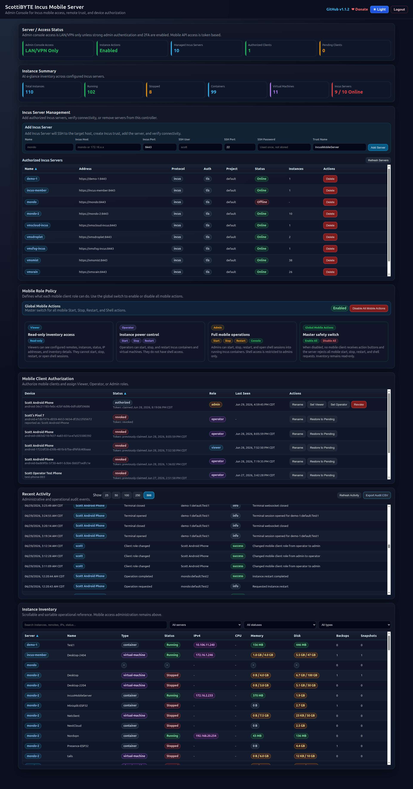

# ScottiBYTE Incus Mobile Server

**ScottiBYTE Incus Mobile Server** is a self-hosted mobile administration gateway for Incus. It provides a secure web-based admin console and an Android client for viewing Incus servers, browsing instances, performing controlled instance operations, and opening an admin-only mobile shell.

The project is designed for homelab and small infrastructure environments where you want safe mobile access to Incus without exposing direct Incus credentials to every device.

## Latest Release

### Server v1.5.0

Server `v1.5.0` improves resilience when Incus remotes are offline or unhealthy and adds complete admin snapshot-management API support.

### Android Client v0.6.0

Android `v0.6.0` adds full snapshot management for authorized Admin clients, including taking, restoring, renaming, and deleting snapshots.

The Android client and server are versioned independently. Android `v0.6.0` is published as an asset on the server `v1.5.0` GitHub release.

## Screenshot



## Features

- Web-based admin dashboard
- First-run admin setup with mandatory 2FA
- Mobile client authorization and role assignment
- Viewer, Operator, and Admin role policy
- Global mobile actions safety switch
- Incus server management from the web UI
- Concurrent inventory scanning across configured Incus remotes
- Partial inventory results when one or more remotes are unavailable
- Distinct Online, Offline, No Quorum, and Inventory Error states
- TCP reachability checks for unavailable Incus remotes
- Start, stop, and restart controls for authorized mobile clients
- Admin-only mobile shell access
- Admin-only snapshot creation, restore, rename, and deletion
- Protected instance support
- Recent Activity audit log
- Adjustable audit display length
- CSV audit export
- Local admin credential reset command

## Architecture

ScottiBYTE Incus Mobile Server acts as a controller between Android clients and one or more Incus servers.

```text
Android Client
    |
    | HTTPS / token-authenticated mobile API
    v
ScottiBYTE Incus Mobile Server
    |
    | Incus CLI / Incus remote trust
    v
Incus Servers
```

The server maintains its own mobile client authorization database and Incus client configuration. Android clients never need direct Incus credentials.

## Role Model

| Role | Access |
|---|---|
| Viewer | Read-only inventory access |
| Operator | Start, stop, and restart instances |
| Admin | Start, stop, restart, shell access, and snapshot management |

The server also includes a global mobile action switch. When disabled, mobile clients remain read-only and the server rejects mobile action requests.

## Docker Deployment

The recommended deployment model is Docker Compose.

```yaml
services:
  incus-mobile-server:
    image: scottibyte/incus-mobile-server:latest
    container_name: scottibyte-incus-mobile-server
    restart: unless-stopped

    ports:
      - "3088:3088"

    environment:
      APP_NAME: "ScottiBYTE Incus Mobile Server"
      PORT: "3088"
      DATA_DIR: "/app/data"
      HOME: "/app/data"
      INCUS_CONF: "/app/data/incus-client"
      APP_TIME_ZONE: "America/Chicago"

      # Set these to the UID/GID that should own the bind-mounted data directory.
      PUID: "1000"
      PGID: "1000"

      TRUST_PROXY: "true"
      ADMIN_ALLOWED_CIDRS: "127.0.0.1/32,10.0.0.0/8,172.16.0.0/12,192.168.0.0/16"

      MOBILE_ACTIONS_ENABLED: "true"
      MOBILE_TERMINAL_ENABLED: "true"
      MOBILE_TERMINAL_IDLE_TIMEOUT_MS: "900000"
      MOBILE_PROTECTED_INSTANCES: "IncusMobileServer"

    volumes:
      - ./docker-data:/app/data

    # Option A: use your LAN DNS servers.
    # dns:
    #   - 172.16.1.10
    #   - 172.16.1.11

    # Option B: define static host mappings for Incus servers.
    # extra_hosts:
    #   - "mondo:172.16.1.225"
    #   - "vmsmist:172.16.1.50"
    #   - "vmsrain:172.16.1.51"
```

Start the server:

```bash
docker compose up -d
```

Then open:

```text
http://<docker-host>:3088/admin
```

### Docker Runtime Data

The container stores persistent application data in:

```text
/app/data
```

With the compose example above, that is persisted on the Docker host as:

```text
./docker-data
```

Persistent data includes:

- SQLite database
- Admin settings
- Mobile client authorizations
- Operation policy
- Audit history
- SSH key used by the Add Incus Server workflow
- Incus client configuration and trusted remote certificates

The Incus CLI reads its persistent client configuration from:

```text
/app/data/incus-client
```

This is controlled by:

```yaml
INCUS_CONF: "/app/data/incus-client"
```

New installs do **not** need to manually create or copy an Incus client configuration. The normal workflow is to start the container, complete first-run admin setup, and add Incus servers from the web UI. The server will create and persist the Incus client trust data under `docker-data/incus-client`.

## Incus Server Name Resolution

The web UI can add Incus servers by hostname or IP address. Since the server runs inside a container, the container must be able to resolve and reach the name you enter.

There are three supported approaches.

### Option 1: Use IP Addresses

This is the simplest and most reliable option.

```text
Incus Host: 172.16.2.14
```

No local DNS is required.

### Option 2: Use LAN DNS

If your LAN already has local DNS through Pi-hole, Unbound, Active Directory, or another resolver, configure the container to use those DNS servers.

```yaml
dns:
  - 172.16.1.10
  - 172.16.1.11
```

Then the Add Incus Server form can use names like:

```text
vmsmist
vmsrain
mondo
```

### Option 3: Use Docker Compose `extra_hosts`

This is the Docker-friendly equivalent of adding entries to `/etc/hosts`.

```yaml
extra_hosts:
  - "mondo:172.16.1.225"
  - "vmsmist:172.16.1.50"
  - "vmsrain:172.16.1.51"
```

This is useful when you do not want to depend on DNS or when the Docker host cannot resolve the same names as the rest of the LAN.

## Incus Server SSH Requirements

The Add Incus Server workflow uses SSH to help establish Incus trust and configure the remote.

Each Incus server you add must have:

- SSH reachable from the container
- An SSH user accepted by the target server
- Either an SSH password or an SSH private key accepted by the target server
- Optional SSH private key passphrase support
- Incus installed and initialized
- Incus API reachable on the configured port, usually `8443`
- Firewall rules allowing the container to reach SSH and the Incus API

The server image includes the client-side tools needed to perform this workflow, including the Incus CLI and OpenSSH client.

## First-Run Setup

On first access to `/admin`, create the web admin account and enroll 2FA.

The admin console controls:

- Incus server authorization
- Mobile client authorization
- Role assignment
- Mobile operation policy
- Audit visibility and export

## Adding an Incus Server

From the web dashboard, enter:

- Name
- Incus host or IP address
- Incus API port
- SSH user
- SSH port
- SSH authentication method: Password or Private Key
- SSH password, or SSH private key with optional passphrase
- Trust name

The server will attempt to establish Incus trust, add the Incus server locally, and verify connectivity.

SSH credentials are used only for the one-time bootstrap step. They are not stored. After bootstrap, the server uses its app-managed SSH key for future managed SSH operations.

## Pairing Android Clients

After the server is configured, install the Android client and point it at the server URL.

Mobile clients appear in the admin dashboard as pending clients until authorized. Once authorized, each client can be assigned one of the available roles:

- Viewer
- Operator
- Admin

Mobile inventory and operation endpoints require an approved mobile bearer token. The health endpoint is public so the Android app can verify basic connectivity before pairing.

## Snapshot Management

Authorized Admin clients can manage instance snapshots from the Android app.

Available operations include:

- Take Snapshot
- View snapshots from newest to oldest
- Restore the newest snapshot
- Rename snapshots
- Delete snapshots

Only the newest snapshot is offered for direct restore. On storage backends such as ZFS, restoring an older snapshot requires removing snapshots created after it. The Android interface therefore hides Restore on older snapshots rather than offering an operation that Incus would normally reject.

Snapshot operations require:

- An approved Admin mobile client
- Global mobile actions enabled
- A target instance that is not protected
- A reachable Incus server with working inventory access

## Remote Availability and Partial Inventory

The server scans configured Incus remotes concurrently.

If one remote is unavailable or an Incus cluster has lost quorum, available remotes can still return inventory. Remote states distinguish between:

- Online
- Offline
- No Quorum
- Inventory Error

This prevents one unavailable server or cluster member from blocking the complete mobile inventory request.

## Audit Log

The Recent Activity section records administrative and operational activity, including:

- Mobile operation requests
- Operation success or failure
- Client authorization changes
- Role changes
- Shell sessions
- Admin credential reset events
- Failed server tests

Successful automatic server health checks are not logged to avoid flooding the audit history.

The dashboard includes selectable display sizes:

```text
25 / 50 / 100 / 250 / 500
```

CSV export is available for deeper audit review.

## Local Admin Credential Reset

If you lose access to the web admin account or 2FA device, use the local reset command on the server:

```bash
scottibyte-incus-mobile-reset-admin
```

For the Docker deployment, the reset command should target the active Docker data directory, for example:

```text
/home/scott/scottibyte-incus-mobile-server/docker-data/mobile.db
```

The Docker-primary reset helper restarts the Docker container after clearing the admin credentials and sessions.

This resets only the web admin account and clears admin sessions.

It does **not** remove:

- Mobile clients
- Incus servers
- App settings
- Operation policy
- Audit history

After running the reset, visit `/admin` to complete first-run admin setup again.

## Migrating From a Previous Non-Docker Install

Existing installs can be migrated by stopping the old service, copying the previous data directory into the Docker runtime data directory, and starting Docker.

Example:

```bash
sudo systemctl stop scottibyte-incus-mobile-server.service

mkdir -p docker-data
cp -a data/. docker-data/

docker compose up -d
```

If the previous deployment used an existing Incus client configuration under the host user's home directory, you may optionally copy it into Docker's Incus client config directory:

```bash
mkdir -p docker-data/incus-client
cp -a ~/.config/incus/. docker-data/incus-client/
```

This migration step is only for existing deployments. New users should add Incus servers through the web UI.

After Docker is verified, the old systemd service can be disabled or removed.

## Persistent Data

For Docker, persistent data is mounted at:

```text
/app/data
```

Recommended host mount:

```yaml
volumes:
  - ./docker-data:/app/data
```

Persistent data includes:

- SQLite database
- Admin settings
- Mobile client authorizations
- Operation policy
- Audit history
- Incus client configuration
- SSH key material used by the server add/trust workflow

Do not commit the persistent data directory to Git.

## Security Notes

- Use HTTPS when exposing the admin console beyond a trusted LAN.
- Keep admin access limited to trusted networks.
- Use strong admin credentials and 2FA.
- Assign mobile clients the least privilege role required.
- Keep the global mobile action switch disabled when operational changes are not needed.
- Use protected instances for infrastructure containers that should not be controlled from mobile.
- Do not enable mobile API auth bypass in production.
- Treat `docker-data` as sensitive runtime state because it contains the SQLite database and Incus client trust material.

## Suggested Reverse Proxy

The server can sit behind a reverse proxy such as Nginx Proxy Manager, Caddy, Traefik, or Nginx.

When using a reverse proxy, set:

```yaml
TRUST_PROXY: "true"
```

The container can be mapped to any host port. For example, this maps host port `3099` to the server's internal port `3088`:

```yaml
ports:
  - "3099:3088"
```

The server log will still say it is listening on port `3088` because that is the port inside the container.

## Project Status

ScottiBYTE Incus Mobile Server is intended as a safe mobile companion for Incus administration. It is not intended to replace the Incus CLI or full administrative workflows, but it provides fast mobile visibility and controlled operational access.
