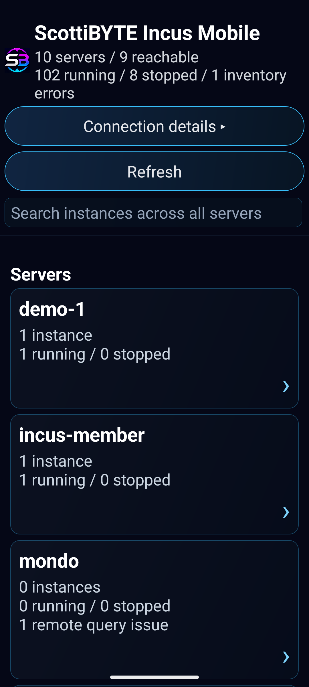
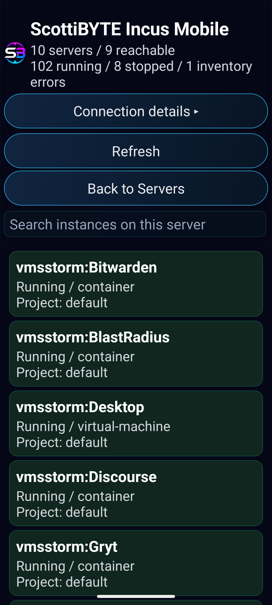
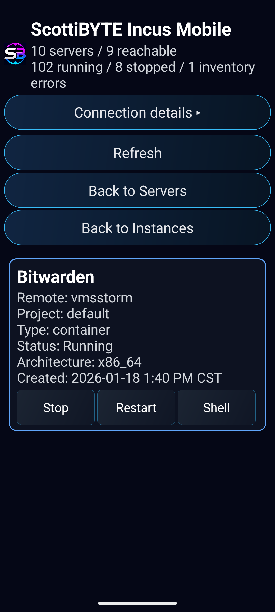
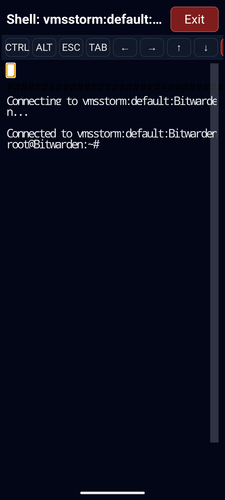

# ScottiBYTE Incus Mobile Android Client

**ScottiBYTE Incus Mobile** is the Android companion app for ScottiBYTE Incus Mobile Server. It provides mobile visibility and controlled administration for Incus servers and instances.

The Android client connects to the ScottiBYTE Incus Mobile Server API. It does not connect directly to Incus servers and does not require Incus credentials on the phone.

## Current Release

### Android v0.6.0

Android `v0.6.0` adds complete snapshot management for Admin clients and improved handling of unavailable or unhealthy Incus remotes.

This client is published as an APK asset on the ScottiBYTE Incus Mobile Server `v1.5.0` GitHub release.

## Screenshots

### Server List



### Instance List



### Instance Details



### Mobile Shell



## Features

- Pair with ScottiBYTE Incus Mobile Server
- View configured Incus servers
- Distinguish Online, Offline, No Quorum, and Inventory Error states
- Continue showing partial inventory when some remotes are unavailable
- Browse instances by server
- Search instance inventory
- View instance details
- Role-aware mobile actions
- Start, stop, and restart instances
- Admin-only shell access
- Admin-only snapshot management
- Take snapshots
- Restore the newest snapshot
- Rename and delete snapshots
- Newest-first snapshot ordering
- Dark-themed snapshot dialogs and confirmations
- Visible snapshot-list scroll indicator
- Global action hiding when mobile actions are disabled on the server
- Read-only mode for Viewer role
- Operator mode for power control
- Admin mode for shell and snapshot access

## How It Works

The Android app talks only to the ScottiBYTE Incus Mobile Server.

```text
Android Client
    |
    | HTTPS / mobile API token
    v
ScottiBYTE Incus Mobile Server
    |
    | Incus CLI / trusted Incus remotes
    v
Incus Servers
```

This keeps Incus trust, SSH setup, and operational policy centralized on the server.

## Roles

The actions visible in the Android app depend on the role assigned to the mobile client in the server admin dashboard.

| Role | Android Access |
|---|---|
| Viewer | View servers, instances, status, and inventory |
| Operator | Viewer access plus start, stop, and restart |
| Admin | Operator access plus shell and snapshot management |

If the global mobile action switch is disabled on the server, all action buttons are hidden and the app remains read-only.

## Pairing Flow

1. Install the Android client.
2. Enter the ScottiBYTE Incus Mobile Server URL.
3. The device registers with the server.
4. The admin authorizes the device in the web dashboard.
5. The admin assigns the device a role.
6. The Android app refreshes and shows the role-appropriate features.

## Server URL

Use the URL for your ScottiBYTE Incus Mobile Server deployment.

Examples:

```text
https://incusmobile.example.com
```

or

```text
http://172.16.2.233:3088
```

HTTPS is recommended for production or remote access.

## Server List View

The server list summarizes configured Incus servers and their instance counts.

The app shows:

- Total servers
- Reachable server count
- Running instance count
- Stopped instance count
- Inventory issues

Selecting a server opens the instance list for that server.

## Instance List View

The instance list shows instances on the selected server.

The app shows:

- Instance name
- Status
- Type
- Project

The search box filters visible instances.

## Instance Details View

The instance details page shows:

- Instance name
- Server
- Project
- Type
- Status
- Architecture
- Created time
- Available actions

For authorized roles, action buttons may include:

- Stop
- Start
- Restart
- Shell
- Take Snapshot
- Manage Snapshots

## Snapshot Management

Admin clients can manage snapshots for eligible instances.

The instance details screen provides:

- **Take Snapshot** to create a new snapshot
- **Manage Snapshots** to restore, rename, or delete existing snapshots

Snapshots are listed newest first. Restore is offered only for the newest snapshot because Incus storage backends such as ZFS may require newer snapshots to be deleted before an older snapshot can be restored.

The snapshot-management dialog includes:

- Restore on the newest snapshot
- Rename on every snapshot
- Delete on every snapshot
- Dark-themed confirmation and rename dialogs
- A visible scroll indicator when additional snapshots are available

Snapshot operations are unavailable when:

- The client is not assigned the Admin role
- Global mobile actions are disabled
- The instance is protected
- The Incus remote is unavailable
- The Incus cluster does not have quorum

## Mobile Shell

Admin clients can open a shell session into eligible running containers.

Shell access is controlled by the server and is only available when:

- The mobile client role is Admin
- The global mobile action switch is enabled
- Mobile terminal support is enabled on the server
- The target instance is allowed
- The target is a running container

Shell sessions are logged in the server audit history.

## Safety Model

The Android app is intentionally not a full Incus administration replacement. Its purpose is safe mobile access for common operational needs.

The app depends on server-side policy for:

- Client authorization
- Role assignment
- Action availability
- Protected instances
- Audit logging
- Global action enable/disable

## Recommended Use

Use the Android client for:

- Checking server health and remote availability
- Checking instance status
- Quickly starting, stopping, or restarting an instance
- Taking and managing snapshots
- Restoring the newest snapshot
- Opening an emergency admin shell
- Verifying mobile operational state

Use the full Incus CLI or administrative workstation for:

- Initial Incus setup
- Storage configuration
- Network configuration
- Image management
- Complex migrations
- Restoring older snapshots when newer snapshots must also be removed

## Requirements

- Android device
- Network access to ScottiBYTE Incus Mobile Server
- A paired and authorized mobile client record
- Server v1.5.0 for complete Android v0.6.0 snapshot management
- Mobile API access enabled on the server

## Versioning

The Android client and server are versioned independently.

Current release versions:

```text
Server: v1.5.0
Android Client: v0.6.0
API Compatibility: v1
```

The Android version balloon checks the server's advertised Android version. When a newer client is available, the balloon becomes a clickable update link to the APK published on the corresponding GitHub release.

Future Android releases may work with older server releases when the API remains compatible, but snapshot management in Android v0.6.0 requires the server-side snapshot API included with server v1.5.0.

## Security Notes

- Do not pair unknown devices.
- Revoke lost or replaced phones immediately.
- Use Viewer role when mobile action access is not required.
- Use Operator role only for users who should perform power actions.
- Use Admin role only for trusted users who need shell access.
- Keep HTTPS enabled when using the app outside a trusted LAN.
